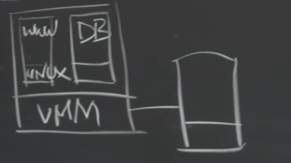
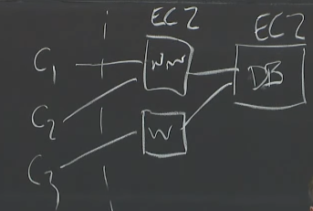
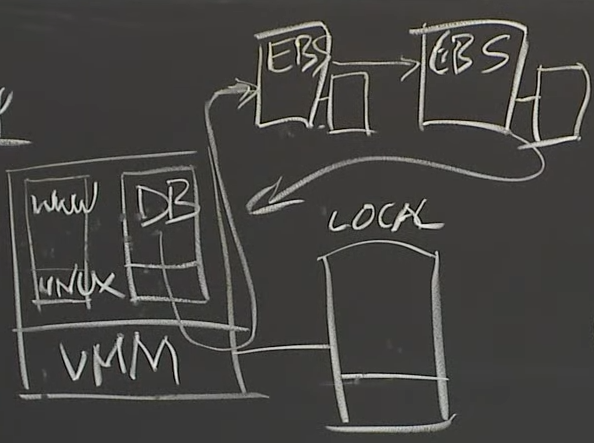
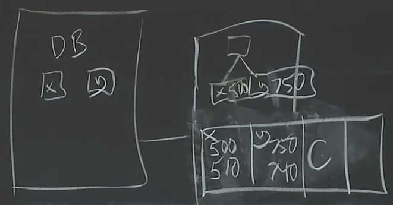
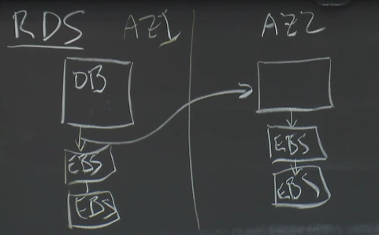
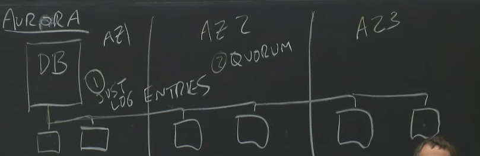
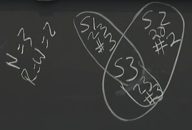
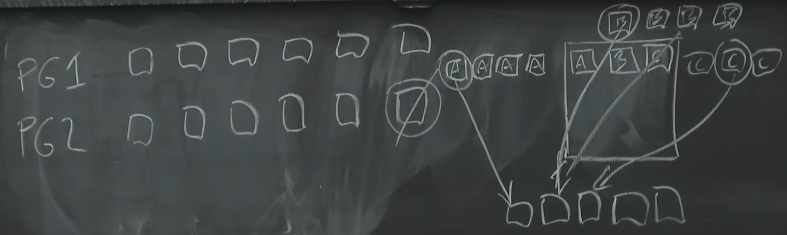

# lec10: Cloud Repllicated DB, Aurora

## history

### 1. EC2 (cloud computing)



+ *target*: cloud computing, aimed at web sites
+ virtual machines instances with virtual local disk stored on directly attached physical disk
+ *pros*:
    + great for www servers: more load, more EC2 instances. if crash, start another instance since stateless and data in DB
+ *cons*:
    + limited scaling options - only DB replicas
    + limited fault-tolerance: if machine crash, disk also dies => periodic backup



### 2. EBS (Elastic Block Store)



+ goal: available even if EC2 instance crashes
+ implementation: pairs of servers with disk drives, chain replication and paxos-based configuration manager
+ *pros*:
    + better fault-tolerance
+ only one EC2 instance can use a given EBS volume at a time, not shared storage
+ *cons*:
    + lots of data sent over network: both log and data
    + not fault-tolerance enough:
        + both replicas in the same "**availability zone(AZ)**"
        + two replicas not enough but chain with more would be slow

### DB tutorial - transaction, crash recovery

### transaction

```
BEGIN---------------
    x = x + 10      | LOCK X,Y
    y = y - 10      |
END-----------------
```



1. transactions
    1. DB server modifies only cached data pages as transaction runs and appends update info to WAL (Write-Ahead Log)
        + "redo log" == MySQL's INNODB transaction log
    2. commit once WAL safe on disk
        + release locks on x and y
        + reply to client
    3. later write modified data pages from cache to disk
2. crash recovery
    + replay "new" values for all committed transactions in log (redo)
    + replay "old" values for uncommitted transactions in log (undo)

### 3. RDS(figures 2 of paper) - database-as-a-service



+ goal: better fault tolerance by cross-*availability zone* replication
+ every database server EBS write sent to *local EBS*and *mirror EBS* driven by another EC2 instance.
+ pros: better fault tolerance
+ cons: too slow, need to send too much data: dirty pages(8k, 16k) and log to all 4 replicas

### 4. Aurora



*main idea*

1. Quorum writes for better fault-tolerance without too much waiting
2. Storage servers understand how to apply DB's log to data pages therefore application-specific not general service
    + so only need to send (small) log entries, not (big) dirty pages
    + sending to many replicas, but not much data

#### Fault Tolerant Goals (only about storage tier)

1. able to *write* w/ one dead AZ
2. able to *read* w/ dead AZ + 1
    + no writes but still serve read operation, and create more replicas
3. transient slow replicas
4. fast re-replication

#### Qourum replication



+ setting
    + N replicas
    + W for writes
    + R for replicas
+ R + W = N + 1
+ need version number to know the correct read result

*don't need to wait for slow/dead replicas*

+ N=6, w=4, R=3
+ storage server: *write logs and read data pages*
    + lazy log apply
    + database server tracks log index for each storage server, not need to totally quorom reads
+ *database server crashes*
    + need quorom reads to find first missing log entry (not necessarilly the highest one) Index and execute *redo operation*

##### Protection Group



+ store log with the data page corresponding to it
+ *parallel recovery*

#### Readonly database

+ use readonly database with cache
+ readonly database request data from storage server using minitrasaction(so storage server cannot reply data currently beging modified by another write operation)
+ database server send update and committed data to readonly database

### take away

+ Quorums for smooth handling of slow/failed replicas
+ network capacity is more important than computing resources
    + only send log and rely on storage server's cpu to do replay operation
+ cross-layer optimization: database server and storage server codesign
    + great performance improvements
    + not general-purpose
