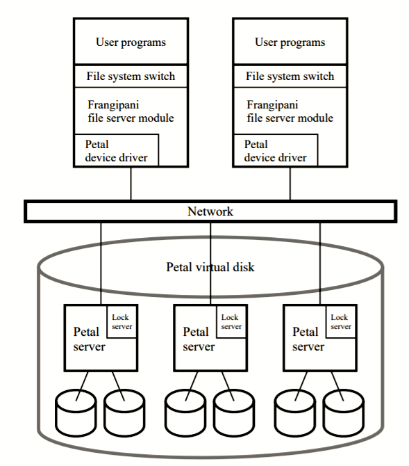
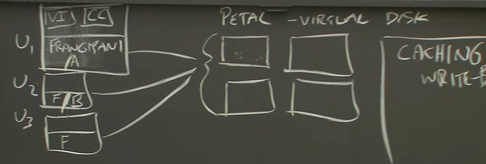
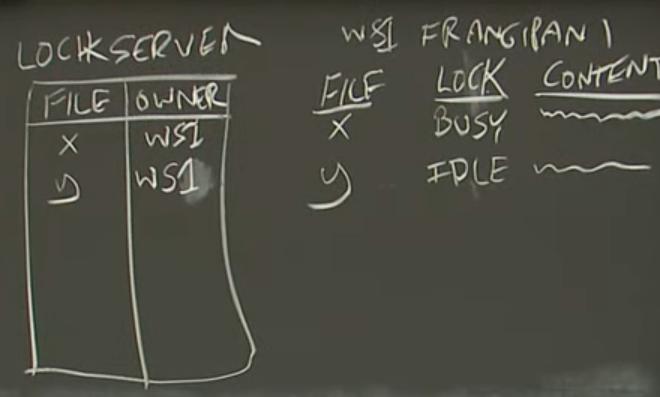
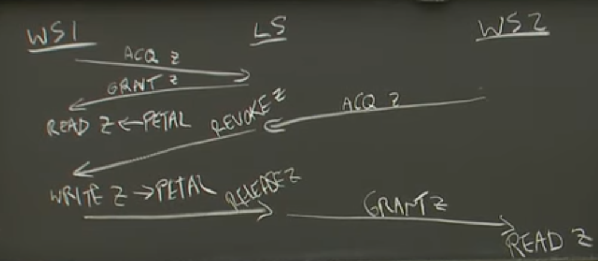

# lec11: Cache Consistency: Frangipani

## why reading this paper?

1. cache coherence
2. distributed transactions
3. distributed crash recovery
4. and the interaction among the three

## overall design

+ *decentralized file service and cache for performance*
+ caching
    + *write back cache*
+ decentralization
    + most cpu time spent in Frangipani client (embedded in workstation/kernel)
    + petal know nothing about frangipani

## Challengens

1. cache coherence
    + 读操作能读到其它client修改的最新的数据
2. atomicity
    + 并发操作应当表现得瞬间发生的操作
3. crash recovery

### cache coherence

+ get benefits of both *linearizaility* and *caching*
+ driven by lock

#### cache protocol

+ if WS holds lock
    + *busy*: using data right now
    + *idle*: holds lock but not using the cached data right now
+ workstation rules
    1. no cache data without a lock
    2. acquire a lock first then read from petal
    3. write petal then release lock
+ coherence protocol messages
    + request: WorkStation -> LockServer
    + grant: LS -> WS
    + revoke: LS -> WS
        + 如果锁idle, 写回锁对应脏数据，释放锁，回复release消息
    + release: WS -> LS

*example*

*the point:*

+ locks and rules force reads to see last write
+ locks ensure that "last write" is well-defined

*optimization*

1. IDLE state
2. shared read lock and exlcusive write lock

### atomicity

>   what if two workstations try to create the same file at the same time? are partially complete multi-write operations visible?  
> e.g. file create initializes i-node, adds directory entry  
> e.g. rename (both names visible? neither?)  

+ *also driven by locks*
+ atomic multi-step operations
    + distributed transactions
+ *two phase lock protocol*
    1. acquire all locks
        + all updates write to petal
    2. release

### crash with locks

+ using write-ahead logging (WAL)

+ novel things
    1. per-WordStation logs (利用循环队列存储，seq判定end)
    2. logs in petal, not local disk, WS2 can read WS1's log to recover from WS1 crashing
+ only log metadata

#### on revoke

1. write all log -> petal, then 
2. write only modified blocks for that lock, then
3. send release message

#### when network partition, WS1 actually alive but cannot response to other WS.

+ using *lease*
    + lock owner can't user a lock past its lease period
    + LS doesn't start recovery until after lease expires

## limitations

+ Most useful for e.g. programmer workstations, not so much otherwise
    + A file system is not a great API for many applications, e.g. web site
+ Frangipani enforces permissions, so workstations must be trusted
+ Frangipani/Petal split is a little awkward
    + both layers log
    + Petal may accept updates from "down" Frangipani workstations
    + more RPC messages than a simple file server
+ cache not very useful in big data computation

## ideas to remember

+ complex clients sharing simple storage -- maybe scalable
+ cache coherence
+ distributed transactions
+ distributed crash recovery
+ interactions among the above
