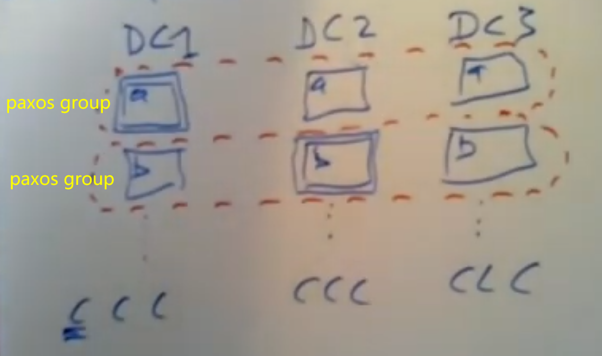
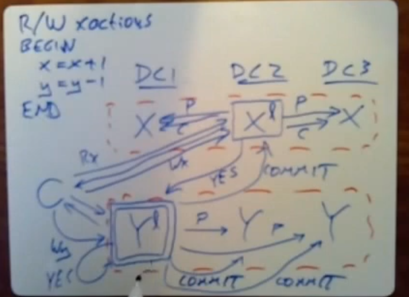
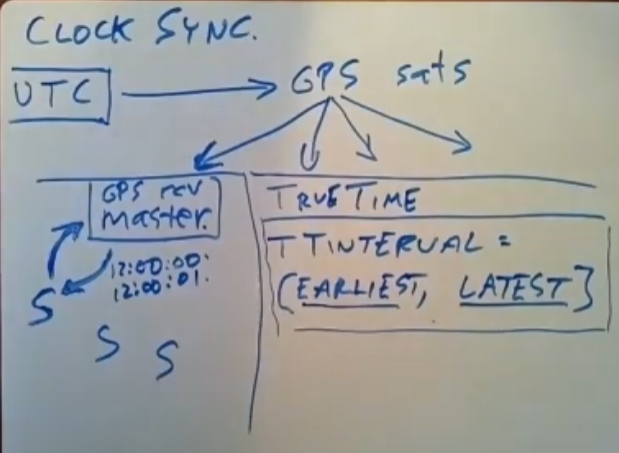

# lec13: Spanner

## architecture



Data is sharded over multiple servers of one datacenter and replicas are in different data centers. *One Paxos group per shard.*

+ sharding allows huge total throughput via parallelism -> performance
+ datacenters fail independently -> fault tolerance
+ clients read from local replica -> performance
+ paxos requires only a majority -> tolerate slow/distant replicas

### challenges

+ read from local replicas but they may be lagging
+ distributed transactions include multiple shards -> multiple paxos groups
+ transactions that read multiple records must be serializable

## R/W transactions

*two-phase commit (2PC) with Paxos-replicated participants*

Do all the reads first and at last do all the writes.



+ client picks a unique transaction id (TID)
+ client sends each read to Paxos leader of relevent shard
    + each shard first acquires a lock on the relevant record
    + separate lock table per shard, in shard leader
+ client keeps writes private unitl commit
+ when client commits:
    + chooses a Paxos group to act as 2PC Transaction Coordinator(TC).
    + [Clients] sends writes to relevant shard leaders.
    + Each written shard leader:
        + Acquires lock(s) on the written records(s)
        + log a "prepare" record *via Paxos*, to replicate lock and new value.
        + Tell TC it is prepared
        + Or tell TC "no" if crashed and thus lost lock table
+ Transaction Coordinator:
    + Decides commit or abort
    + *Logs the decision to its group via Paxos* in case forget
    + Tell participant leaders and client the result
+ Each participant leader:
    + Log the TC's decision via Paxos.
    + Release the transaction's locks.

1. two-phase locking -> serializability
2. two-phase commit -> atomic distributed transaction commit
    + use paxos to tolerant TC failure
3. huge messages

## read-only transactions

For read-only transactions, these involve multiple reads, perhaps from multiple shards.

### idea

1. read from local replicas
    + but local replica may not be up-to-date.
2. lock-free, no 2PC, no transaction manager

### correctness constraints

1. serializable
    + same results as if transactions executed one-by-one
2. external consistency
    + if T1 completes before T2 starts, T2 must see T1's writes.
    + "before" refers to real (wall-clock) time.
    + similiar to lineraizable.

### why not read latest value in the database?

```
Suppose we have two bank transfers, and a transaction that reads both.
  T1:  Wx  Wy  C
  T2:                 Wx  Wy  C
  T3:             Rx             Ry
```

+ not serializable
+ T3's reads should *all* occur at the *same* point relative to T1/T2.

### Solution: SNAPSHOT isolation

assume all servers have synchronized clocks. Assign every transaction a *TIMESTAMP* and execute as if one-at-a-time in time-stamp order:

1. R/W: TS = COMMIT TIME
2. R/O: TS = START TIME

*Multi-version DB*: each record with associated timestamp.

```
                      x@10=9         x@20=8
                      y@10=11        y@20=12
    T1 @ 10:  Wx  Wy  C
    T2 @ 20:                 Wx  Wy  C
    T3 @ 15:             Rx             Ry
  "@ 10" indicates the time-stamp.
```

+ T1 T3 T2
+ T2和T3concurrent，根据linearizability，T2和T3发生先后顺序不一定。
+ *needs to hold multiple copies*

#### cope with stale replica

*safe time*

+ Paxos leaders send writes in timestamp order
+ before serving a read at time 20, replica must see Paxos write for time > 20

## what if clocks aren't synchronized?

0. Not affect r/w transaction.
1. R/O transaction's TS too large?
    + correct but slow
2. R/O transaction's TS too small?
    + may miss recent writes, therefore not external consistent

```
Example of problem if r/o xaction's TS is too small:
  r/w T0 @  0: Wx1 C
  r/w T1 @ 10:         Wx2 C
  r/o T2 @  5:                   Rx?
(C for commit)
```

+ This would cause T2 to read the version of x at time 0, which was 1.
+ 问题在于T1的时间戳选择有问题，即T1在真实时间线上相比时间戳过早提交
    + 解决：要求T1真实提交时间迟于时间戳，这样真实提交时间之后发生的读就能看到T1。

### TrueTime API



+ Time service yields a TTinterval = [ earliest, latest ]
    + provide guaranteed bounds that the correc time must be in somewhere in the interval

### How Spanner ensures that if r/w T1 finishes before r/o T2 starts, TS1 < TS2.(i.e. r/o transaction timestamps are not too small)

+ *START RULE*
    + *TimeStamp = TT.now().latest*
        + r/o - at start time, chose latest bound
        + r/w - when commit begins, chose latest bound
+ *COMMIT WAIT* for r/w transaction
    + before commit, r/w has to delay until TS < TT.now().earliest
    + guarantees that TS has passed，即之后发生的r/o事务选择的时间戳必定大于该r/w时间戳(时间戳必定是单调推进的)

```
  The scenario is T1 commits, then T2 starts, T2 must see T1's writes.
  I.e. we need TS1 < TS2.
  r/w T0 @  0: Wx1 C
                   |1-----------10| |11--------------20|
  r/w T1 @ 10:         Wx2 P           C
                                 |10--------12|
  r/o T2 @ 12:                           Rx?
(P for prepare)
```

+ 时间戳和真实时间是两条线，外部一致性遵守真实时间。时间戳机制使得系统满足较大时间戳r/o事务能看见较小时间戳的r/w事务，但是如果时钟不同步，可能出现较小时间戳的事件发生在较大时间戳事件之后，因此不满足外部一致性。
+ C guaranteed to occur after its TS (10) due to commit wait.
+ Rx occurs after C by assumption, and thus after time 10

### summary

+ Snapshot Isolation gives you serializable r/o transactions.
    + Timestamps set an order.
+ Synchronized timestamps yield external consistency.
    + Even among transactions at different data centers.
    + Even though reading from local replicas that might lag.
