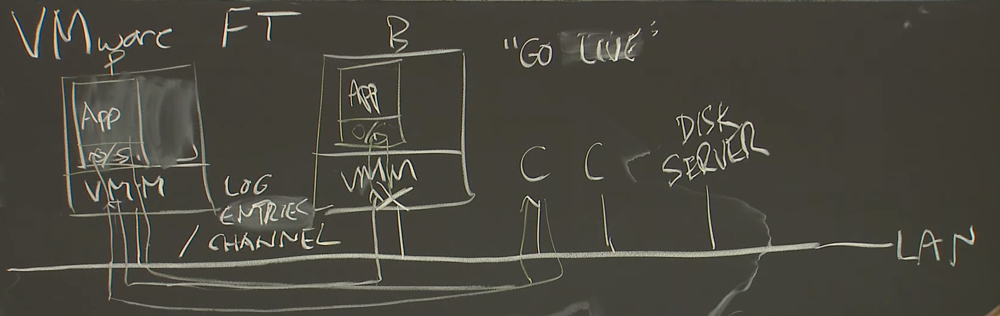

# lec4 Primary-Backup Replication 

> A hypervisor is part of a Virtual Machine system; it's the same as the Virtual Machine Monitor (VMM). The hypervisor emulates a computer, and a guest operating system (and applications) execute inside the emulated computer. The emulation in which the guest runs is often called the virtual machine. In this paper, the primary and backup are guests running inside virtual machines, and FT is part of the hypervisor implementing each virtual machine.

## Failures

+ fail-stop faults: 出现故障时，服务器宕机。并非bugs。某些非fail-stop故障可以转换为fail-stop，例如packet某些位翻转，或者磁盘中数据某些位出错。
    + replication之间需要相对独立

## Fault Tolerance Mechanism

1. State Transfer
    + send copy of primary's RAM to the backup. **-> memory**
    +  more cost
    + more robust in multicore arch
2. Replicated State Machine
    + send *external extent/arriving input* to the backup.**-> op**
    + more complicated

## build FT system

+ what level of state to replicate?
    + *unique*: ** all ** memory and register, don't care what the application is
    + GFS: only application level data
+ how close the synchronize is?
+ switch-over
+ Anomalies
+ New replicas

### basic arch

+ VMM接收到packet
    1. 通过emulated NIC转发给guest os
    2. 发送给replication vmm
+ primary生成回应packet，传给emulated NIC，其VMM发给client
+ replication生成的packet被VMM drop

### Non deterministic events

#### Log entry

+ Inputs: packet 
    1. content of data
    2. timing of interrupt
+ special instructions
    + unique id instruction
    + RNG instruction
+ log entry
    1. instruction # (确定的指令顺序)
    2. type
    3. data(ex. result of the cpu time instruction)

#### bounce buffer解决IO race

通常情况下，当packet到达NIC，通过DMA传送到VM的内存中。但是传送的同时如果guest OS对该处内存进行读操作，则无法确定指令顺序，因此：

1. VM不能直接从NIC通过DMA获取packet，否则vmm无法确定指令执行的序列。
2. VMM从NIC中获取packet放入自己内存中的bounce buffer。
3. VMM挂起guest OS。并将packet放入guest OS的内存中。
4. VMM通过emulated NIC通知guest OS。

### Fault Tolerance

1. Log channel network error
    + output rule: vmm限制vm的输出。

> FT output rule: primary cannot generate any output until send to the backup's buffer and ack the event.

#### limitations

+ primary不能超过backup的状态太多，否则backup需要很长时间恢复。因此在某些时候，primary需要等待backup。

### cut-over

+ 当cut-over时，若生成了duplicate output，tcp packet中的序列号保证了client不会接受该duplicate output。

### split brain

Test-and-set a shared server

### Questions

1. Q: How is the backup FT able to deliver an interrupt at a particular point in the backup instruction stream (i.e. at the same instruction at which the interrupt originally occured on the primary)?
    + A: Many CPUs support a feature (the "performance counters") that lets the FT VMM tell the CPU a number of instructions, and the CPU will interrupt to the FT VMM after that number of instructions.
