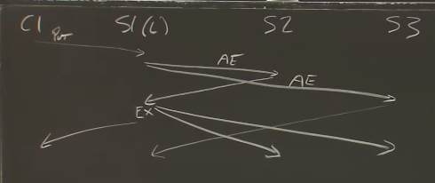

# lec6 Fault Tolerance: Raft(1)

## topics

1. Raft elections and log handling (I)
2. Raft persistence, client behavior, snapshots (II)

## FT systems pattern

+ Mapreduce controlled by one master
+ GFS relies a single master to choose primary for each replication chunk
+ FT primary + backup => relies a single test-and-set server

> Single entity make critical decision. Avoid split brain but single point of failure.

### split brain

```go
replicated test-and-set server: partition

C1 ----- |- S1
         x
C2 ----- |- S2
```

1. client must talk to both server -> *no fault tolerance*
    + worse than have only one server
2. client talk to those it can talk to and regard the other as dead -> split brain
    + maintain network never fails
    + outside agent(human)
    + single point of failure => no fault tolerance

+ *problem*: computers cannot distinguish "server crashed" vs "network broken(network partition)"
+ *solution*: majority vote.(*quorum systems*)
    + idea: *at most one partition can have a majority*
    + 2f + 1 -> can withstand f failures
    + *Paxos*
    + *VSR*
+ raft library

---

## topic: Raft overview

## software view: raft library


### layering

1. Layer1: k/v layer + state(the KV table)
2. Layer2: raft layer + logs
    + Raft is a library included in each replica

### time diagram



+ c1 -> Get/Put(K) to k/v layer in leader
+ leader adds command to log
+ leader sends *AppendEntries* RPCs to followers
+ followers add command to log
+ leader waits for replies from majority
+ entry is "committed" if a majority put it in their logs
    + committed means won't be forgotten even if failures
    + majority -> will be seen by the next leader's vote requests
+ leader executes command, replies to client -> Reply(V)
+ leader "piggybacks" commit info in next AppendEntries
+ followers execute entry once leader says it's committed

#### Why the logs?

+ leader use log to sign and *order* the commands
    + to help replicas agree on a single execution order
    + to help the leader ensure followers have identical logs
+ the log stores tentative commands until committed
+ the log stores commands in case leader must re-send to followers
+ the log stores commands persistently for replay after reboot

> When restart, no server knows how far they had been have executed before the crash. Later, the leader will send the heartbeat and figure out the commit point.

### software stack interface


+ client -> server: start(COMMAND)
    + (index, term)
+ Raft notify application layer -> message on a go channel
    + send ApplyMsg to applyCh
    + (command, index)

```
lab 2 Raft interface
  rf.Start(command) (index, term, isleader)
    Lab 3 k/v server's Put()/Get() RPC handlers call Start()
    Start() only makes sense on the leader
    starts Raft agreement on a new log entry
      add to leader's log
      leader sends out AppendEntries RPCs
      Start() returns w/o waiting for RPC replies
      k/v layer's Put()/Get() must wait for commit, on applyCh
    agreement might fail if server loses leadership before committing 
      then the command is likely lost, client must re-send
    isleader: false if this server isn't the leader, client should try another
    term: currentTerm, to help caller detect if leader is later demoted
    index: log entry to watch to see if the command was committed
  ApplyMsg, with Index and Command
    each peer sends an ApplyMsg on applyCh for each committed entry
    each peer's local service code executes, updates local replica state
    leader sends reply to waiting client RP
```

---

## two main parts of Raft's design:

1. electing a new leader -> split brain
2. ensuring identical logs despite failures -> consistent

## topic: Leader Election

+ Q: Why do we need a leader?
    + A: In common no failure case, a leader is more efficient.
    + A: ensures all replicas execute the same commands, in the same order
+ Raft server
    + new leader -> new term
    + the numbering helps servers follow latest leader, not superseded leader

### start

A Raft peer doesn't hear from current leader for an "election timeout".

Increments local `currentTerm`, tries to collect votes: slow but safe

+ may lead to un-needed elections
+ old leader may still be alive and think it is the leader

#### Ensure at most one leader in a term

+ majority agree
+ each server can cast only one vote per term
    + if candidate, votes for itself
    + if not a candidate, votes for first obeys the rule

### Election fail

1. less than a majority of servers are reachable
2. simultaneous candidate split the vote, none gets majority

fail results:

+ another timeout and new election (and new term)
    + **higher term makes percedence, candidates for older terms quit**

### Choose timeout interval: avoid split votes

> randomized delays are a common pattern in network protocols.

1. Election Timer -> Start Election
    + TERM++, REQUEST VOTE
    + After wins, send Append Entry
        + there is a leader
        + reset the election timer
2. randomize election timer 
    + Q: how to choose the election timeout?
        + at least a few heartbeat intervals (in case network drops a heartbeat) to avoid needless elections, which waste time
        + random part long enough to let one candidate succeed before next starts
        + short enough to react quickly to failure, avoid long pauses
        + short enough to allow a few re-tries before tester gets upset. tester requires election to complete in 5 seconds or less
    + MIN: *broadcastTime* << election timer
        + the average time it takes a server to send RPCs to every server and receive their responses
    + MAX: election timer << *MTBF*
        + the average time between failures for a single server
            1. effect recovery time, depends on failure frequency
            2. the gap between first timer going off the the second timer going off should be longer for assembling votes in case of split vote
    + note: *every time when reset timer, randomly choose the timeout*

### Split Brain

+ a new leader came up, the old leader will not cause problem
    + new leader means a majority of servers have incremented `currentTerm`
        + old leader can't get majority for `AppendEntries`, so old leader can't commit or execute new log entries
        + no split brain, but a minority may accept old leader's `AppendEntries`, so logs may diverge
