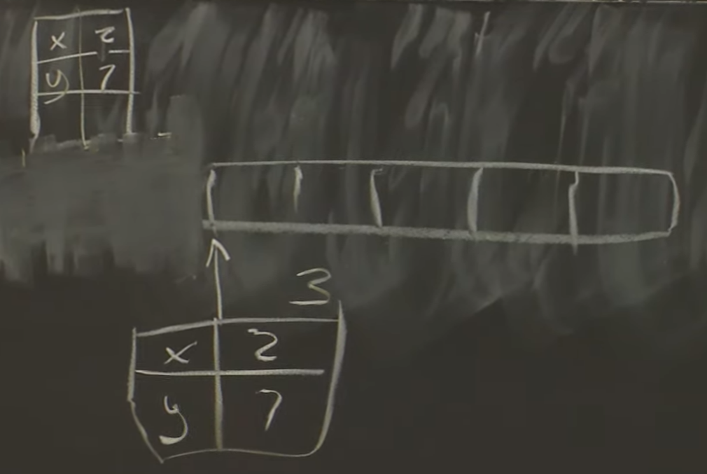

# lec7 Fault Tolerance: Rafs(2)

## topic: log replication

1. when leader stays up: safe
     + data only flow from leader to follower
     + follower cannot see others states or logs
2. when leader changes
     + need to deal with diverging replicas, missing operations, repeated operations

+ *goal:* (state machine safety) if any server executes a given command in a log entry, then no server executes something else for that log entry
     + if a server disagree on the operations, then a change of leader might change the client-visible state, which violates our goal of mimicing a single server.
+ *solution:* 
     1. *consistency check*: Raft forces agreement by having followers adopt new leader's log
     2. *election restriction*: Raft ensures elected leader has all committed log entries

```go
     10  11  12  13
S1   3
S2   3   3   4
S3   3   3   5   6

     10  11  12  13
S1   3   3   5   6
S2   3   3   5   6
S3   3   3   5   6
```

+ *S3's 6 AppendEntry*:
    + nextIndex[S2] = 13 (prevLogIndex = 12, prevLogTerm = 5)
    + nextIndex[S2] = 12 (prevLogIndex = 11, prevLogTerm = 3)
    + overide S2's 12 then 13

### log roll back strategy: FAST Backup

AE

1. XTerm: term of conflicting entry
2. XIndex: index of first entry w/ XTerm
3. XLen: length of Log

```go
// leader doesn't have conflicting entry's term
// nextIndex = XIndex
CASE 1
S1  4  5  5
S2  4  6  6  6

CASE 2
S1  4  4  4
S2  4  6  6  6

CASE 3
S1  4
S2  4  6  6  6
```

## Why not longest log as leader?

```go
S1   5  6  7
S2   5  8
S3   5  8
```

### Election restriction

> vote "yes" only if candidate has higher term in last log entry, OR same last term && >= log len

---

## topic: persistence(synchronous disk update)

+ What would we like to happend after a server crashes?
     + Raft can continue with one missing server but failed server must be repaired soon to avoid dipping below a majority
+ *strategies*:
     1. replace with a fresh (empty) server
     2. reboot crashed server, re-join with state intact, catch up
          + **must** support reboot in case simultaneous power failure

### persistent content

1. Log: only application state
2. currentTerm: logic clock
3. votedFor: in case vote twice

+ When crash, assumes that the application state is destroyed namely the state of application is not persistent. Therefore, need to replay the log from the beginning.
+ bottleneck for performance

---

## topic: log compaction and snapshot



+ snapshot is application dependent
+ use *InstallSnapshotRPC* to send snapshot to followers

> state is often equivalent to operation history you can often choose which one to store or communicate we'll see examples of this duality later in the course

---

## LINEARIZABILITY(strong consistency)

*def:* An execution history is linearizable if there is some total order of the operations in the history that matches the real time for non-concurrent request and each read sees most recent write in the order.

+ history: a record of client operations each with *arguments*, *return values*, *start time*, *completed time*
+ formalizes behavior expected of a single server ("strong" consistency)

every operation appears to execute atomically and instantaneously at some point between the invocation and response.

### examples

#### ex 1

```
  |-Wx1-| |-Wx2-|
    |---Rx2---|
      |-Rx1-|
"Wx1" means "write value 1 to record x"
"Rx1" means "a read of record x yielded value 1"
draw the constraint arrows:
  the order obeys value constraints (W -> R)
  the order obeys real-time constraints (Wx1 -> Wx2)
this order satisfies the constraints:
  Wx1 Rx1 Wx2 Rx2
so the history is linearizable
```

#### ex 2

```
  |-Wx1-| |-Wx2-|
    |--Rx2--|
              |-Rx1-|
draw the constraint arrows:
  Wx1 before Wx2 (time)
  Wx2 before Rx2 (value)
  Rx2 before Rx1 (time)
  Rx1 before Wx2 (value)
there's a cycle -- so it cannot be turned into a linear order. so this history is not linearizable. (it would be linearizable w/o Rx2, even though Rx1 overlaps with Wx2.)

Wx2 -> Rx2 -> Rx1 -> Wx2
```

#### ex 3

```
|--Wx0--|  |--Wx1--|
            |--Wx2--|
        |-Rx2-| |-Rx1-|
order: Wx0 Wx2 Rx2 Wx1 Rx1
so the history linearizable.
```

+ the service can pick either order for concurrent writes
     + ex: Raft placing concurrent ops in the log

#### ex 4

```
|--Wx0--|  |--Wx1--|
            |--Wx2--|
C1:     |-Rx2-| |-Rx1-|
C2:     |-Rx1-| |-Rx2-|
what are the constraints?
  Wx2 then C1:Rx2 (value)
  C1:Rx2 then Wx1 (value)
  Wx1 then C2:Rx1 (value)
  C2:Rx1 then Wx2 (value)
  a cycle! so not linearizable.
```

+ service can choose either order for concurrent writes
+ *but all clients must see the writes in the same order*
     + replicas or caches have to agree on the order in which operations occur

#### ex 5

```
|-Wx1-|
        |-Wx2-|
                |-Rx1-|
constraints:
  Wx2 before Rx1 (time)
  Rx1 before Wx2 (value)
  (or: time constraints mean only possible order is Wx1 Wx2 Rx1)
there's a cycle; not linearizable
```

+ *reads must return fresh data: stale values aren't linearizable even if the reader doesn't know about the write*
+ the time rule requires reads to yield the latest data
+ linearzability forbids:
     1. split brain
     2. forgetting committed writes after a reboot
     3. reading from lagging replicas

#### ex 6

```
suppose clients re-send requests if they don't get a reply
in case it was the response that was lost:
  leader remembers client requests it has already seen
  if sees duplicate, replies with saved response from first execution
but this may yield a saved value from long ago -- a stale value!
what does linearizabilty say?
C1: |-Wx3-|          |-Wx4-|
C2:          |-Rx3-------------|
order: Wx3 Rx3 Wx4
so: returning the old saved value 3 is correct
```

---

## topic: duplicate RPC detection

+ what should a client do if a Put or Get RPC times out?: resend
     + if server is dead, or request dropped
     + if server executed, but request lost 
+ idea: duplicate RPC detection
     + client picks an ID for each request, sends in RPC
     + k/v service maintains table indexed by ID, record value after executing

### design puzzles

1. when can we delete table entries?
2. if new leader takes over, how does it get the duplicate table?
     + all replicas should update duplicate tables as execute
3. if server crashes, how does it restore its table?
     + replay of log
     + if snapshots, snapshot must contain a copy of the table

### keep the duplicate table small

+ one table entry per client, rather than one per RPC
+ *each client has only one RPC outstanding at a time*
+ *each client numbers RPCs sequentially*
+ 类似于tcp中的序列号
+ when server receives client RPC #10
     + can forget lower entries

### duplicate RPC linearizability

k/v server is now returning old values from the duplicate table.

```
example:
  C1           C2
  --           --
  put(x,10)
               first send of get(x), 10 reply dropped
  put(x,20)
               re-sends get(x), gets 10 from table, not 20

what does linearizabilty say?
C1: |-Wx10-|          |-Wx20-|
C2:          |-Rx10-------------|
order: Wx10 Rx10 Wx20
so: returning the remembered value 10 is correct
```

---

## topic: read-only operations

+ Q: does the Raft leader have to commit read-only operations in the log before replying? e.g. Get(key)?
     + could the leader respond immediately to a Get() using the current content of its key/value table?
+ A: no. suppose S1 thinks it is the leader, and receives a Get(k). it might have recently lost an election, but not realize, due to lost network packets. the new leader, say S2, might have processed Put()s for the key, so that the value in S1's key/value table is stale. serving stale data is not linearizable; it's split-brain.
+ read-only operations needs to commit before replying

### Optimization

+ Q: Many applications are read-heavy. committing Get()s takes time. is there any way to avoid commit for read-only operations? this is a huge consideration in practical systems.
+ idea: leases

```
  modify the Raft protocol as follows
  define a lease period, e.g. 5 seconds
  after each time the leader gets an AppendEntries majority,
    it is entitled to respond to read-only requests for
    a lease period without commiting read-only requests
    to the log, i.e. without sending AppendEntries.
  a new leader cannot execute Put()s until previous lease period
    has expired
  so followers keep track of the last time they responded
    to an AppendEntries, and tell the new leader (in the
    RequestVote reply).
  result: faster read-only operations, still linearizable.
```

+ in practice, people are often (but not always) willing to live with stale data in return for higher performance
