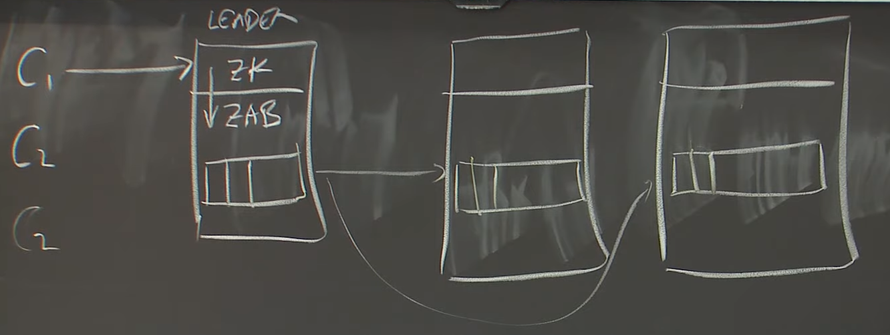

# lecture 8: Zookeeper

## Why ZK?

1. What would the API look like for general-purpose coordination service?
2. Can Nx servrs yield Nx performance?

---

## topic: performance



+ more servers -> slower
+ let replicas serve read operation?    
    + violate linearizability

### ZK guarantees

> Instead of support linearizable. ZK *let replicas serve read operation* but guarantees that all writes are linearizable and each individual client is guaranteed that it can see its past write result. Client may read stale data.

1. linearizable writes
    + clients send writes to the leader, the leader chooses an order, numbered by "zxid"
    + replicas execute in zxid order
2. FIFO client order: *each client specifies an order for its operations(单个client保证FIFO，其它client的写不一定可见)
    + writes - client-specified order
        + by *ready* file
    + read(ZXID) - ***each read executes at a particular point in between the write order***
        1. successive reads execute at non-decreasing points in the order can only read data from state after ZXID(last write's id)
            + if the server fails and change to another server, that server may wait until succeed to that write.
        2. a client's read executes after all previous writes by that client
            + a server block a client's read to wait or *sync()*

#### use case

+ `sync()`cause client reads to see preceding writes
+ writes execute in order, on lates data
+ read order rules ensure "read your own writes"


if read sees "ready" file, subsequent reads see previous writes.

```
e.g. 
     Write order:      Read order:
     delete("ready")
     write f1
     write f2
     create("ready")
                       exists("ready")
                       read f1
                       read f2
     even if client switches servers!
```

watch triggered by a write delivered before reads from subsequent writes.

```
Write order(global order):      Read order:
                                exists("ready", watch=true)
                                read f1
delete("ready") ----------->    notification
write f1        ----------->
write f2        ----------->
                                read f2
```

1. Leader must preserve client write order across leader failure
2. Replicas must enfoce a "a client's reads never go backwards in zxid order"
3. client msut track highest zxid it has read
    + to help ensure next read doesn't go backwards

---

## topic: a general-purpose coordination service

+ API
+ mini-transactions

### Motivation

1. VM-Ft's test-and-set server
    + if one replica can't talk to the other, grabs t-a-s lock, becomes sole server
2. config information
    + GFS: recording list of chunk servers, which chunks, who is primary
3. Master Election

### API overview

1. state: a file-system-like tree of znodes
    + file names, file content, directories, path names
2. znodes types:
    + regular
    + ephemeral
    + sequential: name + seqno

### RPCs

1. CREATE(PATH, data, FLAGS): *exclusive*
2. DELETE(PATH, V)
3. EXISTS(PATH, WATCH)
4. GETDATA(PATH, WATCH)
5. SETDATA(PATH, DATA, VERSIOn)
6. LIST(D)

### example 1: minitransaction

```go
//
// use raft k/v?
// but not atomic
//
x = GET(k)
PUT(k, x + 1)
//
// use zookeeper
// atomic
//
while true
    x,v = GETDATA("f")
    if SETDATA("f", x + 1, v)
        break
    // might sleep for some random time
```

*minitransation*, atomic read-modify-write.

### example 2: lock

+ ACQUIRE

```go
1. if create("f", eiphem=True) return
2. if exists("f", watch=True)
3.      wait
4. goto 1.
```

+ complexity: O(n^2)
+ 每一个锁分配都要发送O(n)个notification RPC

### example 3: lock w/o herd effect

```go
1. CREATE SEQ EPHEM "f"
2. LIST f* // 可能前一个没有持有锁并退出或者持有锁释放/退出，所以需要重新list
3. if no lower # FILE, RETURN
4. if EXISTS(NEXT LOWER #, WATCH)
    WAIT
5. GOTO 2
```

*scalable lock*, *soft lock*

+ 拥有锁的client，可能部分改变状态，然后crash。
+ 下一个获取锁的client需要识别上一个owner的部分改变。
