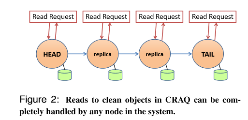

# lecture 9: More Replication, CRAQ

*every node can serve read operation but still preserve strong consistency*

## chain replication

### cr

### craq

*tail sees all the read and write* -> total order

*not partition-proof*, need external *configuration manager* (use RAFT, Paxos or Zookeeper).

## pros and cons

1. pros
    + better read performance but still strong consistency which zookeeper cannot provide.
    + raft leader processes all the read/write operation and send rpc to each replicas
    + each cr replicas processes write operation and send only one rpc to successor and only one replica serves read operation
2. cons
    + but need to wait for any server in the chain.
    + Raft or Paxos need not to wait for a follower, since it only needs to acquire majority vote. Therefore, easier to deploy to different datacenter. (need not to wait a follower in a distant datacenter)
